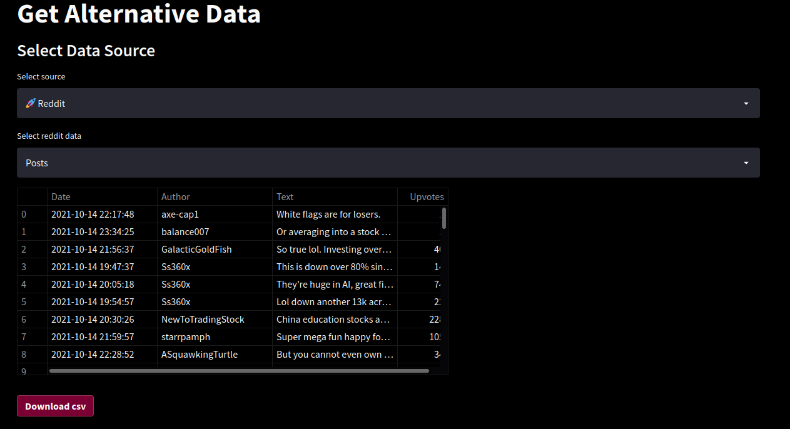
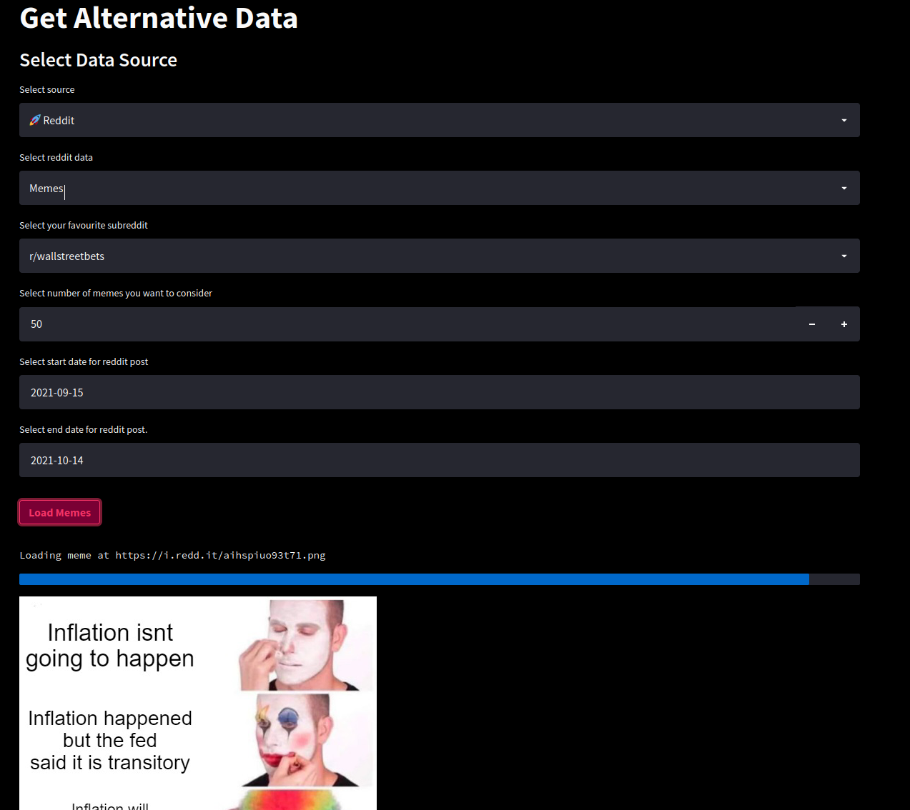
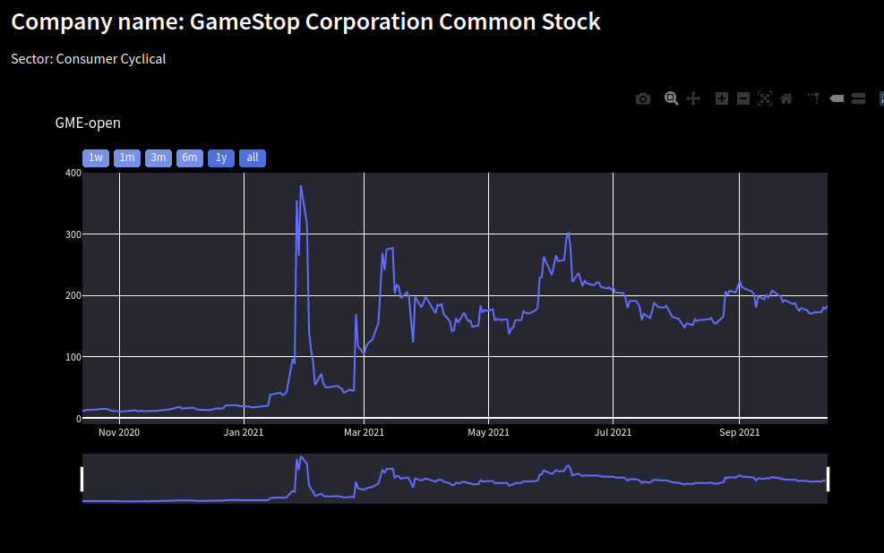
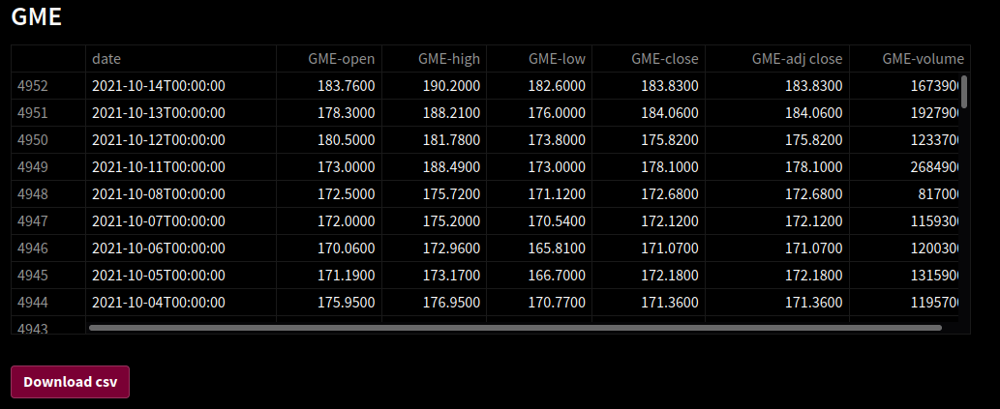

  
  
<h2 align = center> About </h2>
Stock trading has never been so accessible to everybody in the world. We live in an era where the rise of the retail army and the amateur traders are transforming the markets. Investing now is simplified, personal and with a few clicks on your phone you can place orders and execute trades. However, in order to make money while trading you need data.

It is clear to everybody that the web is an enourmous data source and can play a big role on the markets. Last year we saw how an army of amature but united traders on the Reddit forum *r/WallStreetBets* helped drive a meteoric rise in GameStop’s stock price, forcing halts in trading and causing a major headache for the short sellers betting against it and banking on the stock falling. Single tweets of a president, influencer, entrepreneur can disrupt the markets increasing the uncertainty.

That is why, I created a simple [stock data crawler](https://share.streamlit.io/ngocuong0105/stockdatacrawler/app.py) where you can get:

- Historical Stock Prices from Yahoo Finance and Alpha Vantage.
- Reddit posts, comments, replies.
- Reddit memes.
- Twitter posts.

All data is updated in real time (daily) and can be downloaded in simple nicely formatted csv files on which you can do sentiment analysis, image classification (on Reddit memes where people post their stock positions) and other data analysis tasks to improve your trading strategies. **It is time to democratize the spread of information in this industry!**

<h2 align = center> 
  Overview of
  <a href="https://share.streamlit.io/ngocuong0105/stockdatacrawler/app.py"> Stock Crawler
    </a>
</h2>

**1. Download Reddit Posts**  

**2. Get Reddit Memes**  

  

**3. Visualize Stock Data**  

  

**4. Download Stock Data**  

  
